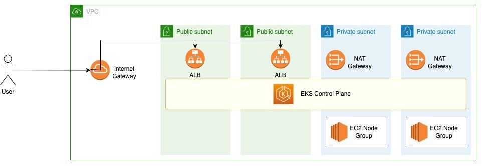

# Deploy EKS Cluster with CloudFormation

This repository contains a well-organized set of CloudFormation Templates to deploy a complete EKS cluster with CloudFormation.
The README files will gide you throuhg the technical details of the repository. Please refer to the ["Blog Post"](https://medium.com/cloud-life/organize-cloudformation-templates-with-external-parameters-file-7998098f1b8d) for an overall documentation of structure and usage.



## The directory structure:

- The root directory contains the "cfnctl" executable file, which is a custom made CloudFormation command line tool which will be used along with this document to deploy and manage the stack.
- The "conf" directory will contain the configuration parameters to the CloudFormation Stack and the "cfnctl" utility.
- The "templates" directory contains the parameterized CloudFormation Templates in the form of a [Nested Stack](https://docs.aws.amazon.com/AWSCloudFormation/latest/UserGuide/using-cfn-nested-stacks.html)

## Usage

### Upload the templates to S3
The initial step of deploying this CloudFormation Stack is to upload the to a pre-created S3 bucket. Run the `upload` command as follows

```
./cfnctl upload 
```
This will upload all the CloudFormation templates in the `"templates"` directory to the S3 bucket mentioned in the [cfnctl.conf](https://github.com/thilinaba/eks-cloudformation/blob/main/conf/cfnctl.conf) file.

### Create the stack
Once the files are uploaded to the S3 bucket, run the `create` command.

```
./cfnctl create 
```
This will create the CloudFormation Stack by using the templates from the above uploaded S3 bucket.

### Update the stack
If there are any modifications required to the stack later, make the changes to your local copy of the template files.
Then upload the modified files back to the S3 bucket using the `upload` command as mentioned above.
Finally run the `update` command to update the stack resources.

```
./cfnctl update 
```

This will update the Stack Resoruces according to the modified templates.

## Configurations

### [cfnctl.conf](https://github.com/thilinaba/eks-cloudformation/blob/main/conf/cfnctl.conf)

The "cfnctl.conf" file contains the config parameters to the "cfnctl" utility which is further described under the "Usage" section of this document.

| Variable | Definition |
| ------ | ------ |
| BUCKET_NAME | The S3 bucket name which will hold the CloudFormation templates. See the prerequisites section of the [Blog Post](https://medium.com/cloud-life/organize-cloudformation-templates-with-external-parameters-file-7998098f1b8d) for more details |
| REGION | AWS region the CloudFormation Stack to be deployed in |
| AWS_PROFILE | The [AWS CLI profile](https://docs.aws.amazon.com/cli/latest/userguide/cli-configure-profiles.html) that you configure with the credentials. If you don't specify such, The defaut value is "default" |
| STACK_NAME | The name of the target CloudFormation stack to be created |
| STACK_PARAMS_FILE | Path to the Stack parameters file |
| STACK_TAGS_FILE | Path to the Stack tags file |
| TEMPLATE_DIR | Path to the CloudFormation templates |

### [stack-params.json](https://github.com/thilinaba/eks-cloudformation/blob/main/conf/stack-params.json)

The "stack-params.json" file holds all the parameters related to the CloudFormation Stack. You can re-use the same stack by customizing just the parameters.

| Variable | Definition |
| ------ | ------ |
| CfnBucketUrl | This is the S3 bucket's HTTPS URL to the `main.yaml` template which. The URL is generated in the format of: "https://`BUCKET-NAME`.s3.`REGION`.amazonaws.com" |
| Environment | A `unique` name. This will be the name prefix to your resources. For example if you sent the environment name as `"dev"`, All the AWS resource created by this stack will have the "`dev-`" prefix apended to their names.|
| VpcBlock | The CIDR block for the VPC |
| PublicSubnet01Block | The CIDR block for the Public Subnet 01 |
| PublicSubnet02Block | The CIDR block for the Public Subnet 02 |
| PrivateSubnet01Block | The CIDR block for the Private Subnet 01 |
| PrivateSubnet02Block | The CIDR block for the Private Subnet 02 |
| EksVersion | The Kubernetes version of the EKS Cluster |
| EksNodeInstanceType | The instance type of the EKS node group |
| EksClusterMinSize | Minimum size of the EKS node group |
| EksClusterDesiredSize | Desired size of the EKS node group  |
| EksClusterMaxSize | Maximum size of the EKS node group  |
| AlbScheme | Set `internal` to make your Load Balancer internal. Set `internet-facing` to make it accessible via the Internet|
| AlbGroupName | This value can be used in your Kubernetes Ingress configuration's `alb.ingress.kubernetes.io/group.name` annotation to identify the ALB where the ingress rule to be created. This prevents creating seperate ALB per each ingress. [More info](https://kubernetes-sigs.github.io/aws-load-balancer-controller/v2.2/guide/ingress/annotations/#group.name)  |


### [stack-tags.json](https://github.com/thilinaba/eks-cloudformation/blob/main/conf/stack-tags.json)

The "stack-tags.json" file holds a JSON formatted Key Value Pairs that will be added as [AWS Tags](https://docs.aws.amazon.com/general/latest/gr/aws_tagging.html) to all the resources created by the CloudFormation Stack. This makes is easy filter and isolate the resources belongs to a particular stack. You have the feedom to use any number of tags, as long as the JSON Key Value format is correctly maintained.